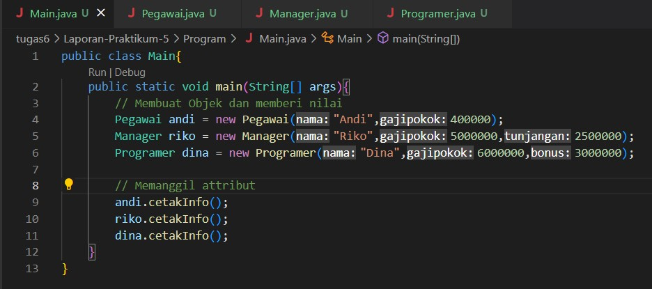

## Laporan-Praktikum-5
# NAMA  : IMAM SOLEHUDIN
# NIM   : 312110290
# KELAS : TI.21.C.1
# MATA KULIAH   : PEMROGRAMAN ORIENTASI OBJEK(CONSTRUCTOR)
# - SOAL !

Dari gambar diatas, tambahkan constructor pada masing-masing class dan tambahkan overload dan override constructor tersebut.

1. Kita buat class pegawai, gunakan type data string untuk nama dan double untuk gajipokok. Berikut Screenshot programnya :

2. Selanjutnya kita buat subclassnya yaitu Manager, pada manager kita gunakan type data double untuk tunjangan, untuk bisa memanggil fungsi nama dan gaji pokok pada class Pegawai kita gunakan extends untuk memanggil fungsi dari class Pegawai dan gunakan super(parameter); contoh : super(String nama, double). Berikut Screenshot programnya :

3. Buat subclass yaitu Programer, kita gunakan type data double untuk bonus, seperti halnya subclass Manager untuk bisa memanggil fungsi nama dan gaji pokok pada class Pegawai kita gunakan extends untuk memanggil fungsi dari class Pegawai dan gunakan super(parameter); contoh : super(String nama, double). Berikut Screenshot programnya :

4. Pada Program ini kita buat objek bernama andi, riko dan dina. pada setiap objek yang kita buat langsung kita manukan nilainya ; contoh : Pegawai andi = new Pegawai ("nama", gajipokok). Setelah itu kita panggil hasilnya fungsi andi.CetakInfo();. Berikut Screenshot programnya :

5. Hasil Program.

